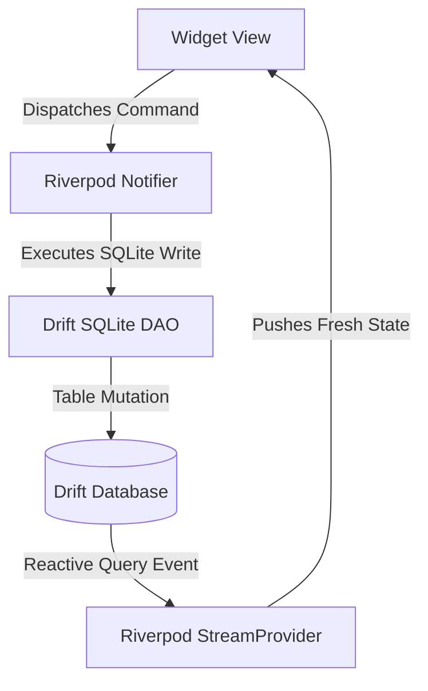

# Architecture — Infernal Ink & Steel Suite

The application is structured to support local, offline-first operations. The business logic (domain) is strictly isolated from persistence configurations and user interface rendering pipelines.

---

## 📂 Folder Structure

```text
lib/
├── app/                        # Application bootstrap & routing
│   ├── app.dart                # MaterialApp setup with theme configurations
│   ├── router.dart             # GoRouter setup mapping feature screen nodes
│   └── theme/                  # Gothic visual definitions
│       ├── tokens.dart         # Hex colors and visual spacers
│       └── infernal_theme.dart # Dark theme definitions
│
├── features/                   # Core application capabilities (slices)
│   ├── admin/                  # User administration
│   ├── appointments/           # Scheduling and waitlists
│   ├── auth/                   # Local session management
│   ├── clients/                # Customer directory ledger
│   ├── communications/         # Outbound messaging
│   ├── dashboard/              # Summation center
│   ├── documents/              # File archives and waivers
│   ├── inventory/              # Supply logs
│   ├── quotes/                 # Calculation algorithms
│   ├── reports/                # Performance analytics
│   ├── settings/               # Global configurations
│   └── tools/                  # Pain estimator & Flash roulette
│
└── shared/                     # Cross-feature structures
    ├── widgets/                # Reusable visual widgets
    ├── utils/                  # Cryptography and date formatting
    └── domain/                 # Core domain entity structures
```

---

## 📦 Package Organization

To comply with the Single Responsibility Principle, each operational feature under `features/` separates responsibilities into distinct directories:

* **presentation/**: Stateless and stateful widget layouts, sliders, text inputs, and event hooks.
* **data/**: Provider and repository classes bridging user interface demands to persistent sqlite database access models.

---

## ⚡ State Management

The application utilizes **Riverpod 3.x** as its core state management solution, operating under a unidirectional data flow design:

1. **State Injection**: Widgets listen to Riverpod Providers.
2. **Read-only Presentation**: Widgets rebuild reactively when Providers update.
3. **Intent Dispatch**: Widgets dispatch Commands to Riverpod Notifiers (mutating local SQLite states).
4. **Reactive Push**: Drift's live SQLite queries detect table events, pushing fresh records to Providers, which in turn push updates to active UI screens.



---

## 🔄 Data Flow

To maintain domain purity, SQLite primary keys, foreign keys, or Drift-specific annotations never leak into `lib/shared/domain/`.

```text
               +--------------------------------------+
               |          PRESENTATION LAYER          |
               | (Widgets list data streams & forms)  |
               +------------------+-------------------+
                                  |
                                  | Reads / Dispatches Commands
                                  v
               +--------------------------------------+
               |            SERVICES LAYER            |
               | (Riverpod state notifiers & logic)   |
               +------------------+-------------------+
                                  |
                                  | Maps Domain to Persistent Models
                                  v
               +--------------------------------------+
               |          PERSISTENCE LAYER           |
               | (Drift DB schema & SQLite DAOs)      |
               +--------------------------------------+
```

---

## 🛡️ Ownership Rules

* **Clients** are owned by the global shop system repository.
* **Appointments, Quotes, and Documents** are logically owned by a specific Client.
* **AuditLogs** are owned by the global system ledger.
* **User profiles** are owned by system administration.
